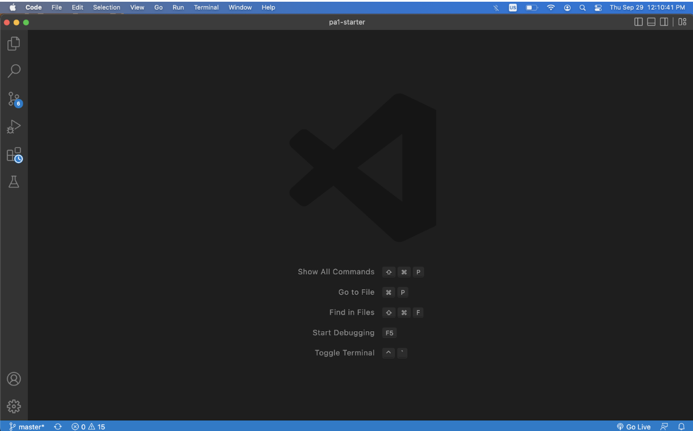
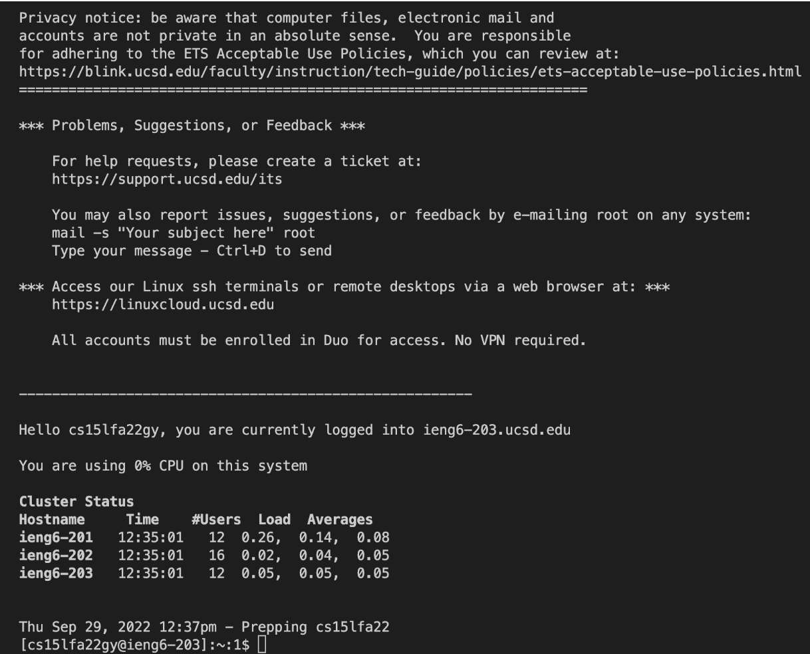
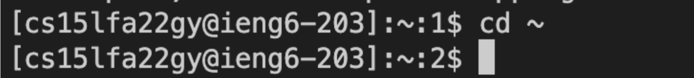
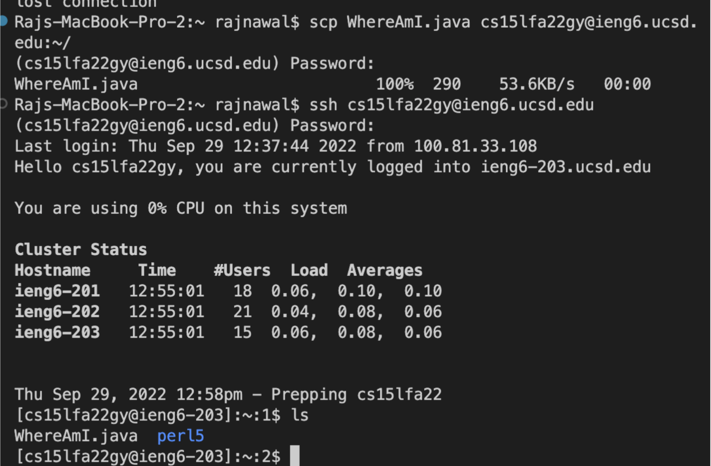
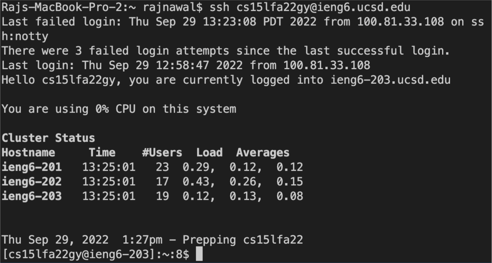
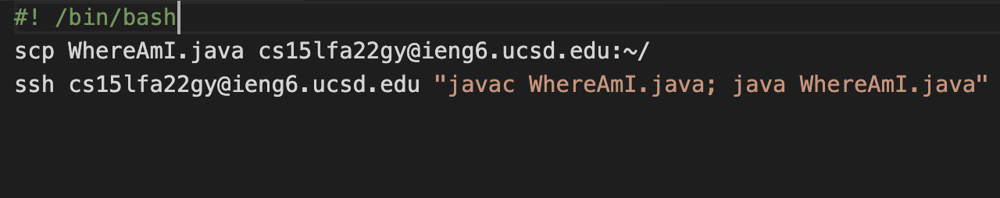

## Installing VSCode
I already had VSCode installed on my device, so I did not have to do anything this time. But, if you do not have VSCode already installed on your machine then navigate to https://code.visualstudio.com/ and download the version that is compatible with your machine. 

## Remotely Connecting
Open up a terminal in one of the following ways:
* Click Terminal in the menu bar when you have VSCode open, and then click New Terminal
* Use the keyboard shortcut ctrl + \`  
  
Once you have the terminal open, type the following command into your terminal(substituting your actual letter combination in):   
 `$ ssh cs15lfa22<your letter combination>@ieng6.ucsd.edu`  
   
You will be prompted to enter your password; if it is your first time connecting to the server then you will be prompted to trust the authenticity of the connection: type "yes" and hit enter.

Upon a successful connection your screen should look similar to this:

## Trying Some Commands
Once you are connected to the server, there are multiple commands you can try. Here are some commands and what they do:
* `cd ~` moves you to the home directory of the machine it is run on

* `cd <path>` moves you to the specified path
* `ls -lat` lists all of the files, including hidden files, in the current directory in long format ordered by time of last edit.
* `cp <path to copy from> <path to copy to>` copies the content from the file/folder on the frist path to the second path

## Moving Files with scp
On your computer write the following command in your terminal: substituting the pertinent values in.  
`scp <path to file on client> cs15lfa22<your letter combination>@ieng6.ucsd.edu:<path to copy to on server>`  
So, for me it was  
`scp WhereAmI.java cs15lfa22gy@ieng6.ucsd.edu:~/`  
  
You will be prompted to input your password. Once you input your password correctly, the file will be copied onto the server.  
  
The process looks like this:

## Setting an SSH Key
To save time when connecting to the remote server we will generate a key value pair.  
Run the command `ssh-keygen` on the client machine.  
Follow the instructions that follow.  
SSH onto the server, use the command `mkdir .ssh` and then logout.  
Then use the following command on the client terminal(substituting the pertinent values in) `scp <path>/.ssh/id_rsa.pub cs15lfa22@ieng6.ucsd.edu:~/.ssh/authorized_keys`  
  
If you have done everything correctly, then the login process should look as follows:

## Optimizing Remote Running
To make your experience even more pleasant, you can write a bash script with the commands you have to repeatedly type. Then you can simply run the bash script. Here is a simple script I wrote:
