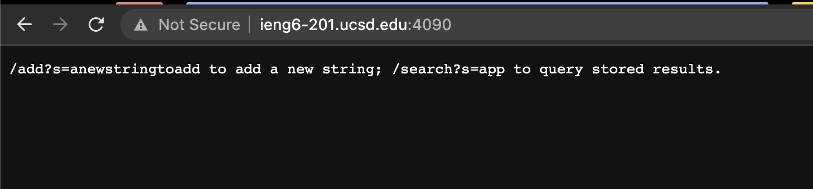

# Part 1
## Code for Search Engine

```
import java.io.IOException;
import java.lang.reflect.Array;
import java.net.URI;
import java.util.ArrayList;

class StringHandler implements URLHandler {
    // The one bit of state on the server: a number that will be manipulated by
    // various requests.
    ArrayList<String> storedStrings = new ArrayList<>();

    public String handleRequest(URI url) {
        if (url.getPath().equals("/")) {
            return String.format("/add?s=anewstringtoadd to add a new string; /search?s=app to query stored results.");
        } else if (url.getPath().contains("/add")) {
            String stringToAdd = url.getQuery().split("=")[1];
            storedStrings.add(stringToAdd);
            return String.format(stringToAdd + " was added to the stored list!");
        } else {
            System.out.println("Path: " + url.getPath());
            if (url.getPath().contains("/search")) {
                String result = "";
                String substringToMatch = url.getQuery().split("=")[1];
                for(String s : storedStrings){
                    if(s.indexOf(substringToMatch) >= 0){
                        result += s + " ";
                    }
                }
                return String.format(result);
            }
            return "404 Not Found!";
        }
    }
}

class SearchEngine {
    public static void main(String[] args) throws IOException {
        if(args.length == 0){
            System.out.println("Missing port number! Try any number between 1024 to 49151");
            return;
        }

        int port = Integer.parseInt(args[0]);

        Server.start(port, new StringHandler());
    }
}
```

## Screenshots detailing the behavior of the code above

The following screenshot is what is displayed when an individual navigates to the port on which my code is running.

1. The `handleRequest` method is called when someone navigates to this page.
2. The argument to the method is the url the individual navigated to; in this it would be http://ieng6-201.ucsd.edu:4090.
3. The fields of the class do not change for this URL.

In the following screenshot we will observe the code's behavior when a new string is to be added to the list of all stored strings.

1. Once again the `handleRequest` method is called. 
2. The argument to the method is a url: http://ieng6-201.ucsd.edu:4090/add?s=cheese. The field storing all of the strings is empty before this method is called.
3. The field storing all of the strings, an ArrayList of Strings called storedStrings in my case, changes: `"cheese"` is added to it and its size goes upto 1.

Lastly, the following screenshot details the behavior when a search is made with a query.

1. The `handleRequest` method is called once again.
2. The argument to the method is a url: http://ieng6-201.ucsd.edu:4090/search?s=ee. The field storedStrings, contains one item when the method is called, namely `"cheese"`. 
3. The field, storedStrings, does not change at the end of the execution of this method.

# Part 2

### averageWithoutLowest:
- Failure-inducing input: {1.0, 1.0}
<!-- -->
```
@Test
  public void testAverageWithoutLowest(){
    double[] input = { 1.0,1.0};
    assertEquals(1.0, ArrayExamples.averageWithoutLowest(input), 0.001);
  }
```
<!-- -->
- Symptom: The function returned 0.0 instead of 1.0.  
<!-- -->  
```
There was 1 failure:
1) testAverageWithoutLowest(ArrayTests)
java.lang.AssertionError: expected:<1.0> but was:<0.0>
        at org.junit.Assert.fail(Assert.java:89)
        at org.junit.Assert.failNotEquals(Assert.java:835)
        at org.junit.Assert.assertEquals(Assert.java:555)
        at org.junit.Assert.assertEquals(Assert.java:685)
        at ArrayTests.testAverageWithoutLowest(ArrayTests.java:22)

  FAILURES!!!
```
<!-- -->
- Bug: The method excludes every number that is the lowest, so if the lowest number appears multiple times, then the average will be off.  
Code fix follows:
<!-- -->
```
    static double averageWithoutLowest(double[] arr) {
    if(arr.length < 2) { return 0.0; }
    double lowest = arr[0];
    double sum = 0.0;
    for(double num : arr) {
      sum += num;
      if(num < lowest) { lowest = num; }
    }
    return (sum - lowest) / (arr.length - 1);}
```
<!-- -->

- Connection between symptom and the bug: As the bug was excluding all occurences of the lowest number, the output was `0.0` because the argument array solely consisted of the same number twice. Thus, both occurences were ignored, and the output ended up being `0.0`.

### filter:
  - Input: {“irony”, “smile”}
<!-- -->
```
  @Test
    public void testFilter(){
        List<String> input = List.of("irony", "smile");
        StringChecker checker = new NewChecker();

        assertArrayEquals(input.toArray(), ListExamples.filter(input, checker).toArray());
    }   
```
<!-- -->
  - Symptoms: Output was {“smile”, “irony”}
<!-- -->
```
  1) testFilter(ListTests)
arrays first differed at element [0]; expected:<[irony]> but was:<[smile]>
        at org.junit.internal.ComparisonCriteria.arrayEquals(ComparisonCriteria.java:78)
        at org.junit.internal.ComparisonCriteria.arrayEquals(ComparisonCriteria.java:28)
        at org.junit.Assert.internalArrayEquals(Assert.java:534)
        at org.junit.Assert.assertArrayEquals(Assert.java:285)
        at org.junit.Assert.assertArrayEquals(Assert.java:300)
        at ListTests.testFilter(ListTests.java:13)
        ... 32 trimmed
Caused by: org.junit.ComparisonFailure: expected:<[irony]> but was:<[smile]>
        at org.junit.Assert.assertEquals(Assert.java:117)
        at org.junit.Assert.assertEquals(Assert.java:146)
        at org.junit.internal.ExactComparisonCriteria.assertElementsEqual(ExactComparisonCriteria.java:8)
        at org.junit.internal.ComparisonCriteria.arrayEquals(ComparisonCriteria.java:76)
        ... 38 more
```
<!-- -->
  - Bug: The function added every string that passed the check to front, which effectively returned all the strings that passed the check in reversed order.
  - Connection between symptom and bug: The resulting array was in the reversed order of the expected array. This is because in the code, every element that passed the filter was being added to the front. This is why we saw what we did.   
  Code to fix the bug follows:
<!-- -->
``` 
    static List<String> filter(List<String> list, StringChecker sc) {
    List<String> result = new ArrayList<>();
    for(String s: list) {
      if(sc.checkString(s)) {
        result.add(s);
      }
    }
    return result;
    }
```