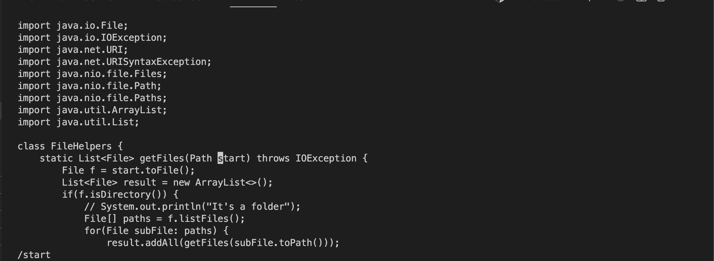
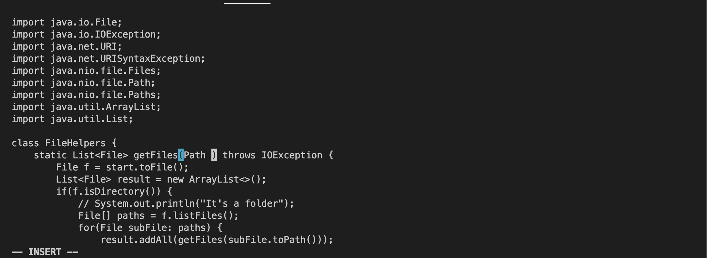
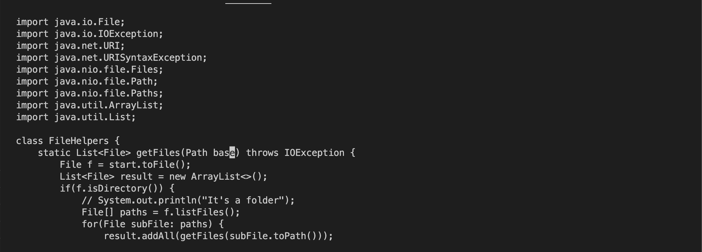
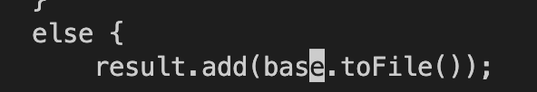

# Part 1
### Changing the parameter `start` to `base`
Here is how I accomplished this task in Vim

1. I started by typing `/start<Enter>`. This moved my cursor to the first occurence of `start`

2. I then typed `ce` which resulted in `start` being deleted and Vim entering Insert mode

3. I then typed `base<Esc>` which resulted in base being inserted where I wanted it to be.

4. I then pressed `n.` which jumped my cursor to the next occurence of `start` and replaces it with `base`

5. I once again pressed `n.` to produce the same result as the one in step 4.

6. Lastly, I pressed `:w<Enter>` to save the changes I made to the file.

# Part 2
Time taken with local edits and scp: 10.13s  
Time taken with ssh method: 21.24s

- Which of these two styles would you prefer using if you had to work on a program that you were running remotely, and why?
    - I would prefer working with the making edits on VSCode and then using `scp` to move my code over to the remote computer. This is because I am accustomed to VSCode and I can work a lot faster on it. Additionally, it is a lot more powerful than Vim so it can catch any errors I make.
- What about the project or task might factor into your decision one way or another? (If nothing would affect your decision, say so and why!)
    - If the project or task is extremely minute then I might opt to use Vim on the remote computer instead. This is because with `scp` I have to ensure I am copying the file over to the wrong path and depending on the path it might not be worth my effort to get the path right. Additionally, with smaller edits there is a lower probability of me needing the utilities of an editor like VSCode. 