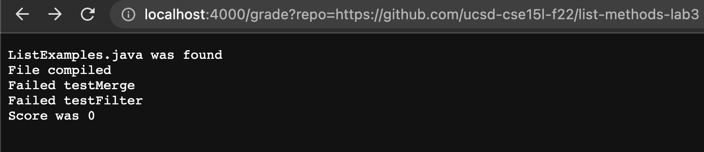
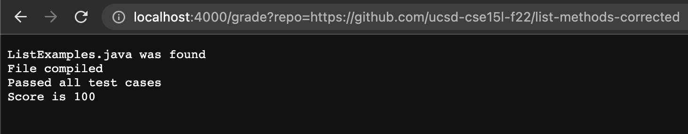
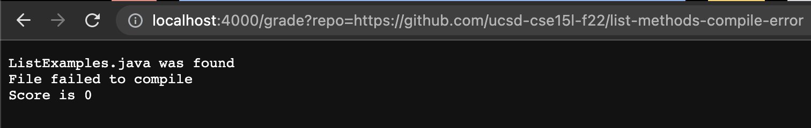

# Lab Report 5

## grade.sh
```
rm -rf student-submission
git clone --quiet $1 student-submission 

cp TestListExamples.java student-submission
cp ParseOutput.java student-submission
cd student-submission

if [[ !(-e ListExamples.java)]]
then
    echo "ListExamples.java was not found!"
    echo "Score is 0"
    exit 1
fi
echo "ListExamples.java was found"
CP="-cp .:../lib/hamcrest-core-1.3.jar:../lib/junit-4.13.2.jar"

javac $CP *.java 2>a.txt

if [[ !($? -eq 0) ]]
then
 echo "File failed to compile"
 echo "Score is 0"
 exit 1
fi

echo "File compiled"
OUTPUT=$(java $CP org.junit.runner.JUnitCore TestListExamples)

java ParseOutput $OUTPUT

echo "Score is $?"
```

This script works in conjunction with `ParseOutput.java`; the code for this file is as follows.
```
public class ParseOutput {
    public static void main(String[] args) {
        String s = String.join("", args);
        if(s.indexOf("FAILURE") < 0) {
            System.out.println("Passed all test cases");
            System.exit(100);
        }
        else{
            if (s.indexOf("testMerge") > -1) {
                System.out.println("Failed testMerge");
            }
            if (s.indexOf("testFilter") > -1) {
                System.out.println("Failed testFilter");
            }
        }
        System.exit((2 - Integer.parseInt(args[args.length - 1])) * 50);
    }
}
```
## Grading Script Behavior for 3 different student submissions
1.  
2. 
3. 

## Tracing grade.sh

I will be tracing my grading script for the third example student submission.

Line 1: The exit code is 0  
Line 2: The exit code is 0  
Line 4: The exit code is 0  
Line 5: The exit code is 0  
Line 6: The exit code is 0  
Line 8: The `if` condition evaluates to false since the file exists  
Lines 9-13: These lines are not run since the `if` branch does not evaluate to true  
Line 14: The `stdout` is "ListExamples.java was found", and the error code is 0.  
Line 17: The `stderr` is 
```
ListExamples.java:15: error: ';' expected
        result.add(0, s)
                        ^
1 error
```
The exit code is non-zero.  
Line 19: The `if` condition evaluates to true since the exit code for `javac` was non-zero.  
Line 21: The `stdout` is "File failed to compile", and the exit code is 0.  
Line 22: The `stdout` is "Score is 0", and the exit code is 0.  
Line 23: The exit code is 0.  
The rest of the lines do not execute due to an early exit.